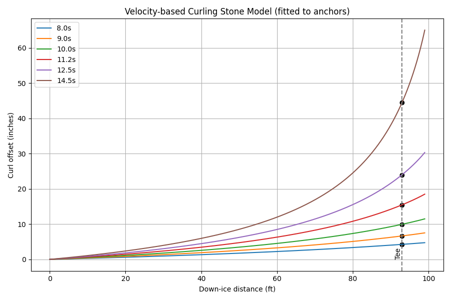

# Glencoe Curling Simulator 2025-2026

A sophisticated web-based curling simulator built with D3.js that provides realistic stone physics, game management, photo-based stone detection, and strategic position analysis.



## 🎮 Live Demo

**[Play the Simulator Online](https://johnpoole.github.io/glencoe_curling_2025-2026/)**

*No installation required - runs directly in your browser!*

## Features

### 🥌 Realistic Physics Simulation
- **Accurate stone dynamics**: Implements realistic curling physics including friction, rotation, and ice conditions
- **Execution errors**: Human-like shot variation based on 12,800 shot database
- **Interactive sweeping**: Press and hold spacebar during shots to simulate active sweeping
- **Collision detection**: Stones interact naturally with each other and boundaries
- **Variable ice conditions**: Adjust curl and straight factors to simulate different ice conditions

### 📷 Photo Stone Detection (NEW!)
- **Upload real photos**: Take overhead shots of curling houses and upload them
- **Automatic detection**: Computer vision identifies red and yellow stones
- **Real game analysis**: Load actual game situations into the simulator
- **Easy workflow**: Drag & drop photos, click detect, analyze positions

### 🎮 Complete Game Management
- **Full 16-stone ends**: Alternating shots between red and yellow teams
- **Proper throwing order**: Handles hammer (last stone advantage) correctly
- **Scoring system**: Automatic end scoring with running totals
- **Game state tracking**: Tracks current end, stones thrown, and team turns

### 📊 Strategic Analysis
- **Shot accuracy metrics**: Real-time display of execution probabilities by shot type
- **Position evaluation**: Analysis of stone positions and scoring probabilities
- **Advantage calculation**: Shows which team has the positional advantage
- **Probability buckets**: Displays likelihood of different scoring outcomes (-8 to +8 points)
- **Interactive histogram**: Visual representation of scoring probabilities by team color

### 🎯 Shot Controls
- **Throw weight**: Adjustable initial velocity (1.76-4.0 m/s)
- **Spin control**: Set rotation rate and direction (clockwise/counterclockwise)
- **Sweep factor**: Control initial ice conditions and active sweeping
- **Target placement**: Click to set target position on the sheet

### 📈 Data Export
- **JSON export**: Export current stone positions and game data
- **Coordinate systems**: Supports both sheet-relative and button-centered coordinates
- **Analysis integration**: Data formatted for external analysis tools

## Getting Started

### Prerequisites
- A modern web browser (Chrome, Firefox, Safari, Edge)
- Local web server (for CORS compliance with ES modules)

### Running the Application

#### Option 1: VS Code Live Server (Recommended)
1. Install the "Live Server" extension in VS Code
2. Right-click on `index.html`
3. Select "Open with Live Server"
4. The app will open in your default browser

#### Option 2: Python HTTP Server
```bash
cd glencoe_curling_2025-2026
python -m http.server 8000
```
Then open `http://localhost:8000` in your browser

#### Option 3: Node.js HTTP Server
```bash
npx http-server . -p 3000
```
Then open `http://localhost:3000` in your browser

## How to Use

### Basic Gameplay
1. **Set shot parameters**: Adjust throw weight, spin, and sweep factor
2. **Choose target**: Click on the curling sheet to set your target
3. **Execute shot**: Click "Throw Stone" or press Enter
4. **Watch simulation**: Observe the stone's path and final position
5. **Continue play**: Alternate between teams until all 16 stones are thrown

### Keyboard Shortcuts
- **Spacebar**: Hold during shot execution to activate sweeping
- **Enter**: Execute the current shot
- **?**: Show help and keyboard shortcuts
- **Escape**: Cancel current shot or close dialogs

### Advanced Features
- **Manual stone placement**: Enable "Manual Throw" to place stones directly
- **Position analysis**: View real-time strategic evaluation in the analysis panel
- **Data export**: Use the "Export" button to save game data as JSON
- **Reset controls**: Clear the sheet or reset to start a new end

## Project Structure

```
glencoe_curling_2025-2026/
├── index.html              # Main application entry point
├── css/
│   └── styles.css          # Application styling
├── js/
│   ├── models/             # Core game logic
│   │   ├── GameController.js    # Main game state management
│   │   ├── Physics.js          # Physics calculations
│   │   ├── Simulation.js       # Stone simulation engine
│   │   ├── SheetRenderer.js    # SVG rendering for curling sheet
│   │   └── Stone.js            # Stone object model
│   ├── analyze/            # Position analysis
│   │   └── curlingeval.js      # Strategic position evaluator
│   └── [other modules]     # UI, constants, utilities
├── curling_pivot_model.py  # Python physics model reference
└── curl_path_model.py      # Path calculation utilities
```

## Technical Details

### Physics Engine
The simulator implements a comprehensive physics model including:
- **Friction coefficients**: Separate values for sliding and rolling friction
- **Angular momentum**: Stone rotation affects curl trajectory
- **Ice conditions**: Configurable straight and curl factors
- **Collision mechanics**: Elastic collisions between stones

### Coordinate Systems
The application uses two coordinate systems:
- **Sheet coordinates**: Origin at hog line, positive Y toward house
- **Button-centered**: Origin at tee (button center) for analysis

### Browser Compatibility
- Requires ES6 module support
- Uses D3.js v7 for SVG manipulation
- Tested on modern browsers (Chrome 90+, Firefox 88+, Safari 14+)

## Contributing

This project simulates the sport of curling with attention to realistic physics and strategic gameplay. Contributions welcome for:
- Physics model improvements
- UI/UX enhancements
- Additional analysis features
- Performance optimizations

## License

This project is for educational and recreational purposes. Curling is a sport governed by the World Curling Federation.

---

*Experience the strategy and precision of curling from your browser!* 🥌